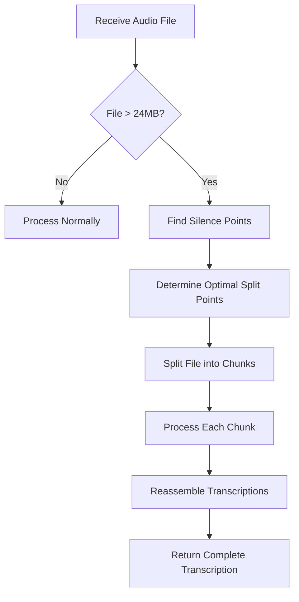

# Audio Chunking Architecture for Whisper Service

## Overview

This document outlines the architecture for handling large audio files in the Whisper Transcription Service when using the OpenAI API mode. The OpenAI API has a 25MB file size limit, which necessitates splitting larger files into smaller chunks, processing each chunk separately, and then reassembling the transcriptions.

## Problem Statement

When using the OpenAI API mode, the service encounters failures when attempting to send audio files larger than 25MB to the endpoint. To address this limitation, we need to implement a chunking mechanism that:

1. Identifies files exceeding the size limit
2. Intelligently splits them at appropriate points (preferably during silence)
3. Processes each chunk individually
4. Reassembles the transcriptions into a cohesive result

## Solution Architecture

### High-Level Flow



### Components

1. **Size Checker**
   - Determines if a file exceeds the 24MB threshold (providing a 1MB safety margin)
   - Triggers the chunking process for oversized files

2. **Silence Detector**
   - Uses ffmpeg's silencedetect filter to identify periods of silence in the audio
   - Generates a list of timestamps where silence occurs

3. **Chunk Splitter**
   - Determines optimal split points based on silence detection
   - Creates individual audio chunks at these points
   - Ensures each chunk is below the 24MB limit

4. **Chunk Processor**
   - Sends each chunk to the OpenAI Whisper API
   - Tracks the processing status of each chunk
   - Handles retries and errors

5. **Transcription Assembler**
   - Combines the transcriptions from all chunks
   - Ensures proper ordering and continuity
   - Returns a unified transcription result

### Chunking Algorithm

The algorithm follows these rules:

1. If a file is smaller than 24MB, process it normally
2. If a file is larger than 24MB:
   - Find the first optimal silence break after the 24MB boundary
   - If no silence is found within the next 1MB (up to 25MB), go back 2MB from the boundary
   - Look for a silence point within this 2MB window
   - If still no silence point is found, go back another 1MB (to 23MB) and search again
   - If no suitable silence point can be found, abort the transcription with an error

3. After splitting off the first chunk, repeat the process with the remainder of the file until the entire audio has been processed

### Technical Implementation

1. **Silence Detection**
   - Use ffmpeg's silencedetect filter to identify silence periods:
   ```
   ffmpeg -i input.mp3 -af silencedetect=noise=-30dB:d=0.5 -f null -
   ```
   - Parse the output to extract silence start and end timestamps

2. **Audio Splitting**
   - Use ffmpeg to split the audio at the determined points and convert to optimized MP3:
   ```
   ffmpeg -i input.file -ss [start_time] -to [end_time] -vn -ar 16000 -ac 1 -c:a libmp3lame -q:a 4 chunk1.mp3
   ```
   - Parameters optimized for speech:
     * 16kHz sample rate (optimal for speech recognition)
     * Mono audio (sufficient for voice)
     * MP3 quality level 4 (good balance of quality and size)

3. **File Size Estimation**
   - Use ffprobe to estimate the size of audio segments:
   ```
   ffprobe -v error -show_entries format=duration -of default=noprint_wrappers=1:nokey=1 input.mp3
   ```
   - Calculate approximate file size based on bitrate and duration

## Error Handling

1. **No Silence Found**
   - If no suitable silence points can be found, the service will return an error indicating that the file cannot be processed
   - Suggestion to the user: "Please try a file with more natural pauses or manually split the audio file"

2. **Chunk Processing Failures**
   - If any chunk fails to process, retry up to 3 times
   - If retries fail, mark the job as failed and provide detailed error information

3. **Temporary File Management**
   - All temporary chunk files will be stored in the /app/temp directory
   - Files will be automatically cleaned up after processing, regardless of success or failure

## Performance Considerations

1. **Parallel Processing**
   - Chunks can be processed in parallel to improve overall throughput
   - Limit parallel processing based on available system resources

2. **Memory Management**
   - Stream audio data when possible to minimize memory usage
   - Implement proper cleanup of temporary files and resources

3. **Progress Tracking**
   - Provide detailed progress information for chunked processing jobs
   - Allow users to monitor the status of individual chunks

## Optimizations

1. **Efficient Audio Format**
   - All audio is converted to MP3 format with optimized settings for speech
   - Reduces bandwidth usage when sending to OpenAI API
   - Maintains quality necessary for accurate transcription
   - Consistent format across all processing stages

## Future Enhancements

1. **Adaptive Silence Detection**
   - Dynamically adjust silence detection parameters based on audio characteristics
   - Implement multiple silence detection passes with varying sensitivity

2. **Content-Aware Splitting**
   - Develop more sophisticated splitting algorithms that consider semantic boundaries
   - Use machine learning to identify optimal split points based on content

3. **Transcript Smoothing**
   - Implement algorithms to improve the continuity between chunk transcriptions
   - Handle potential duplications or gaps at chunk boundaries
