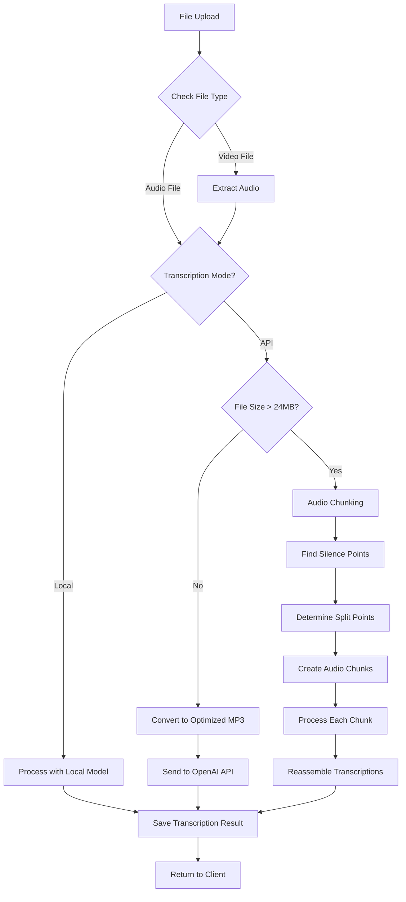
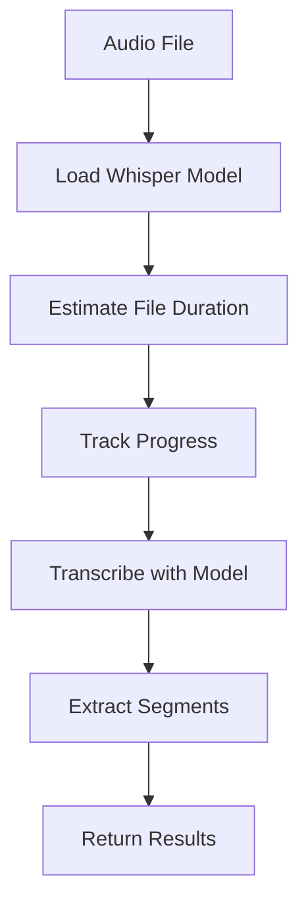
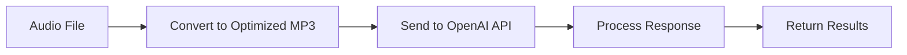
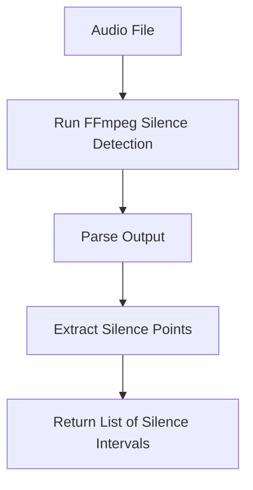
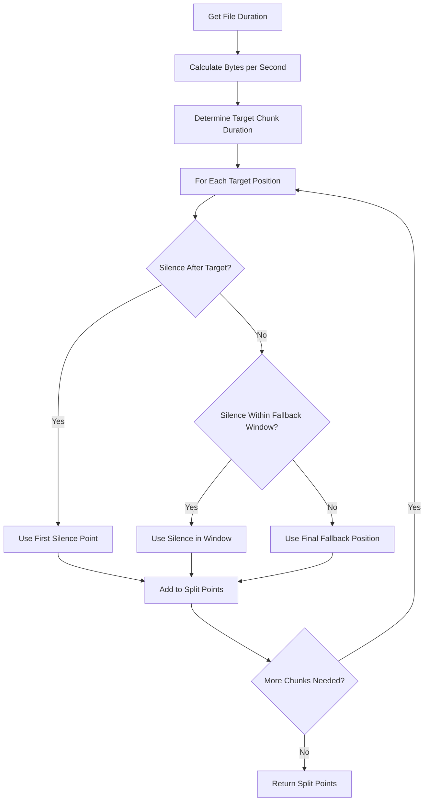
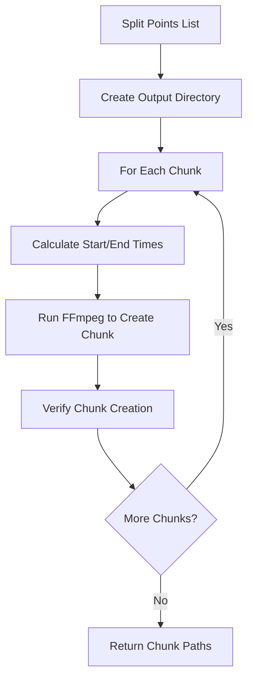
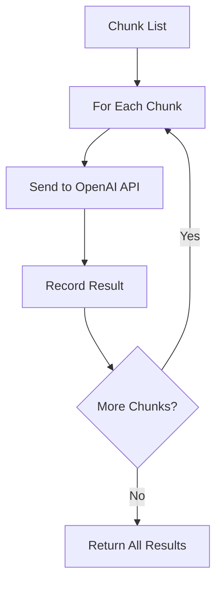
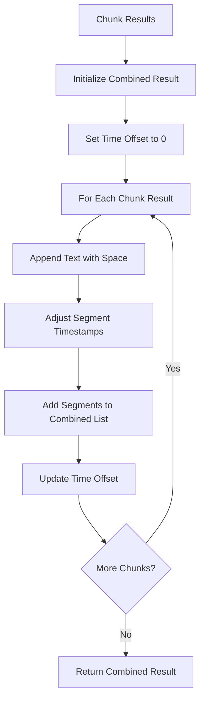
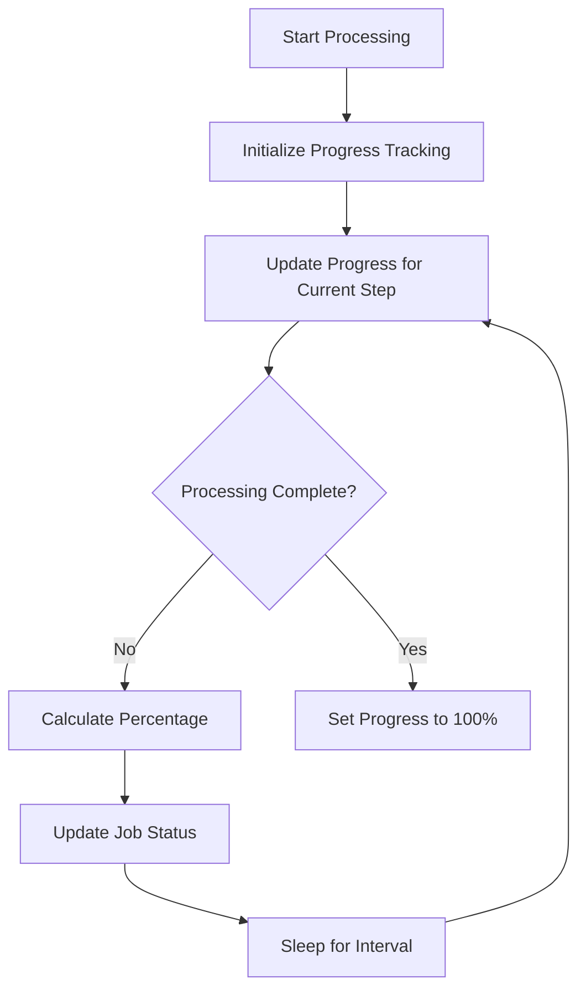

# Audio Processing Pipeline

This document details the audio processing pipeline in the Whisper Service, providing a deep dive into how audio files are handled from upload to transcription.

## Pipeline Overview



## File Input Processing

### Supported Formats
The service supports a variety of audio and video formats:
- **Audio**: MP3, WAV, M4A, OGG, FLAC
- **Video**: MP4, MKV (with audio extraction)

### Audio Extraction from Video
For video files (MP4, MKV), the service extracts the audio stream:


FFmpeg command used for extraction:
```bash
ffmpeg -i video_file.mp4 -vn -acodec pcm_s16le -ar 16000 -ac 1 -y temp_audio.wav
```

Parameters:
- `-vn`: Disable video
- `-acodec pcm_s16le`: Convert to PCM WAV
- `-ar 16000`: Set sample rate to 16kHz (Whisper's preferred rate)
- `-ac 1`: Convert to mono

## Transcription Modes

### Local Model Processing

For local mode, the service:
1. Loads the Whisper model ("base" by default)
2. Processes the audio file directly with the model
3. Returns the transcription result with segments and timestamps



### API Mode Processing

For API mode, the service:
1. Checks if the file exceeds the 24MB size limit
2. For files under the limit, optimizes and sends directly to the API
3. For files over the limit, implements the chunking strategy

#### Single File Processing


MP3 Optimization:
```bash
ffmpeg -i input_file.wav -vn -ar 16000 -ac 1 -c:a libmp3lame -q:a 4 -y output_file.mp3
```

Parameters:
- `-ar 16000`: 16kHz sample rate (optimal for speech recognition)
- `-ac 1`: Mono audio (sufficient for voice)
- `-c:a libmp3lame`: MP3 codec
- `-q:a 4`: Quality level 4 (good balance of quality and size)

## Audio Chunking Process

For files exceeding the 24MB limit in API mode, the service implements a sophisticated chunking strategy:

### 1. Silence Detection



The service uses ffmpeg's silencedetect filter:
```bash
ffmpeg -i input_file.mp3 -af silencedetect=noise=-30dB:d=0.5 -f null -
```

Parameters:
- `noise=-30dB`: Silence threshold (default: -30dB)
- `d=0.5`: Minimum silence duration (default: 0.5 seconds)

### 2. Determining Split Points



The algorithm:
1. Calculates approximate bitrate (bytes per second)
2. Determines target duration for each chunk (to stay under 24MB)
3. For each target position:
   - Looks for silence just after the target
   - If not found, searches within a fallback window
   - If still not found, uses a hard cutoff

### 3. Creating Chunks



Each chunk is created as an optimized MP3 file:
```bash
ffmpeg -i input_file.mp3 -ss start_time -to end_time -vn -ar 16000 -ac 1 -c:a libmp3lame -q:a 4 -y chunk_000.mp3
```

### 4. Processing Chunks



Chunk processing includes:
- Retry logic (up to 3 attempts per chunk)
- Detailed progress tracking
- Error handling for failed chunks

### 5. Reassembling Transcriptions



The reassembly process:
1. Combines text from all chunks with spaces between
2. Adjusts segment timestamps based on position in the full audio
3. Creates a unified list of segments with correct timing

## Progress Tracking

Throughout the pipeline, the service implements detailed progress tracking:



For chunked processing, progress is calculated based on:
1. Number of chunks processed
2. Position within current chunk
3. Timestamp information from segments

## API Interface

The processed audio results in a structured JSON response:

```json
{
    "text": "The complete transcribed text...",
    "segments": [
        {
            "start": 0.0,
            "end": 2.5,
            "text": "First segment text..."
        },
        {
            "start": 2.5,
            "end": 5.0,
            "text": "Second segment text..."
        }
    ]
}
```

## Cleanup Process

After processing is complete:
1. Temporary files are removed
2. Memory is freed with garbage collection
3. Job status is updated
4. Results are stored for retrieval

## Summary

The Whisper Service's audio processing pipeline provides a robust solution for transcribing audio files of any size. Key features include:

1. Support for multiple audio and video formats
2. Intelligent handling of large files through chunking
3. Optimization of audio for speech recognition
4. Detailed progress tracking and reporting
5. Efficient reassembly of chunked transcriptions
6. Strong error handling and retry mechanisms