# Job State Transitions in Whisper Service

This document illustrates the state transitions for transcription jobs in the Whisper Service.

## Job Status State Diagram

```mermaid
stateDiagram-v2
    [*] --> uploading: File upload begins
    
    uploading --> queued: File upload complete
    
    queued --> processing: Job starts processing
    
    state processing {
        [*] --> audio_extraction: If video format detected
        audio_extraction --> transcription: Audio extracted
        [*] --> transcription: If audio format
        
        state transcription {
            [*] --> chunking_check
            chunking_check --> chunking: If file > 24MB
            chunking_check --> single_file: If file ≤ 24MB
            
            state chunking {
                [*] --> find_silence
                find_silence --> split_audio
                split_audio --> process_chunks
                process_chunks --> reassemble
            }
        }
    }
    
    processing --> terminated: User cancels job via DELETE /jobs/{job_id}
    
    processing --> failed: Error during processing
    
    processing --> completed: Transcription successful
    
    terminated --> [*]
    failed --> [*]
    completed --> [*]
```

## Detailed State Descriptions

### Initial States

- **uploading**: The file is being uploaded to the server. Job record is created with `status: "uploading"`.
- **queued**: File upload is complete, and the job is waiting to be processed. Changed to `status: "queued"` after saving the file.

### Processing State

- **processing**: The job is actively being processed. This is a composite state with several sub-states:
  
  - **audio_extraction**: If the input file is a video format (MP4, MKV), the audio is being extracted.
  - **transcription**: The audio is being transcribed, with two possible paths:
    - **chunking**: For files larger than 24MB in API mode, the chunking process is active.
    - **single_file**: For files smaller than 24MB, they are processed as a single unit.
  
  - **Chunking Sub-states**:
    - **find_silence**: Identifying silence points for natural segmentation.
    - **split_audio**: Creating individual audio chunks at silence points.
    - **process_chunks**: Processing each chunk with the transcription engine.
    - **reassemble**: Combining the transcriptions from all chunks.

### Terminal States

- **completed**: The transcription has finished successfully.
- **failed**: An error occurred during processing. The error details are stored with the job.
- **terminated**: The job was manually cancelled by the user.

## Status Update Mechanism

The service includes a status update mechanism that runs in a separate thread for each job. This thread continuously updates the job status with progress information:

## Status Checks

Clients can query the status of a job using the `/status/{job_id}` endpoint, which returns:

1. Basic job information (ID, status, creation time, filename)
2. Progress information for jobs in the "processing" state
3. Error details for jobs in the "failed" state
4. Results or result availability for jobs in the "completed" state

## Job Termination

Jobs can be terminated at any point during the "processing" state using the `/jobs/{job_id}` DELETE endpoint. This:

1. Sets the job status to "terminated"
2. Stops the status update thread
3. Removes any thread references
4. Allows for resources to be cleaned up

This state diagram provides a comprehensive view of how jobs flow through the Whisper Service, from initial upload to completion, with all possible state transitions.