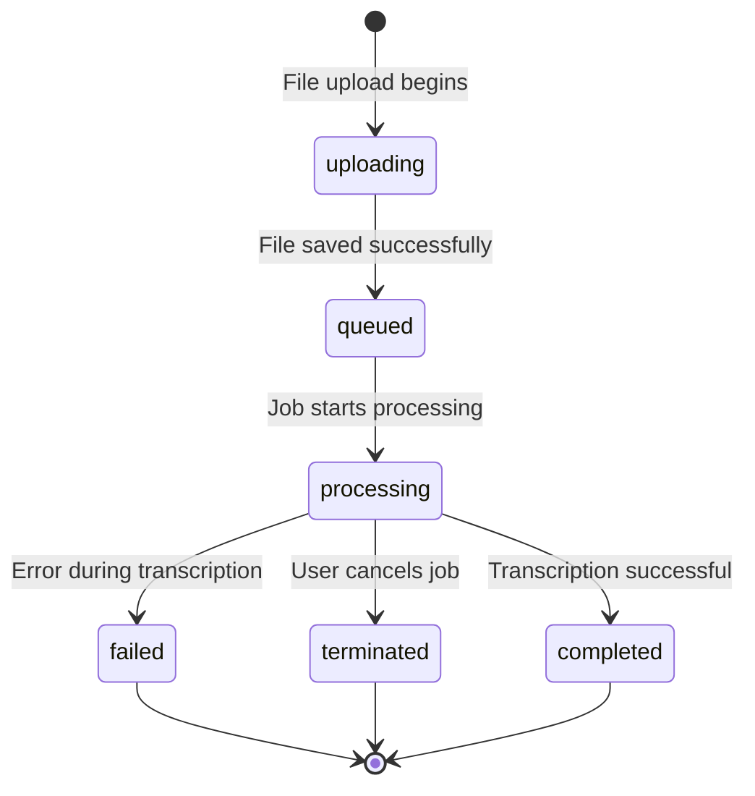

# Whisper Service Architecture

This document provides a comprehensive overview of the Whisper Transcription Service architecture, detailing the processing pipeline, component interactions, and state transitions.

## Service Overview

The Whisper Transcription Service is a system designed to transcribe audio and video files using OpenAI's Whisper model. It supports two operation modes:

1. **Local Compute Mode**: Runs the Whisper model locally on your machine with GPU acceleration (if available)
2. **API Mode**: Uses OpenAI's Whisper API for transcription, requiring less computational resources

Both modes support a variety of audio and video formats (.mp3, .wav, .m4a, .mp4, .ogg, .flac, .mkv) and include optimizations for handling files of any size.

## Transcription Process Flow

```mermaid
flowchart TD
    Client[Client] -->|POST /transcribe| A[File Upload]
    A --> B[Generate Job ID]
    B --> C[Save File]
    C --> D[Queue Job]
    D --> E[Return Job ID]
    E --> Client
    
    subgraph BackgroundProcessing[Background Processing]
        D --> G[Process Large File]
        G --> H{Mode?}
        
        H -->|Local| I[Load Local Model]
        H -->|API| J[Check File Size]
        
        J -->|>24MB| K[Audio Chunking]
        J -->|≤24MB| L[Process with API]
        
        I --> M[Transcribe with Local Model]
        K --> N[Process Chunks with API]
        N --> O[Reassemble Transcription]
        
        M --> P[Save Result]
        L --> P
        O --> P
    end
    
    Client -->|GET /status/{job_id}| Q[Check Job Status]
    Q --> R[Return Status & Progress]
    R --> Client
    
    Client -->|GET /transcript/{job_id}| S[Stream Transcript]
    S --> T[Return Transcription]
    T --> Client
```

## Job State Transitions



## Key Components

### 1. FastAPI Application (`main.py`)
- Provides RESTful API endpoints for job submission, status checking, and transcript retrieval
- Manages job queuing and background processing
- Implements real-time status updates for in-progress jobs

### 2. Audio Processing (`process_audio.py`)
- Handles different audio formats and conversions
- Extracts audio from video files (MP4, MKV)
- Implements both local and API processing modes
- Optimizes audio for transcription

### 3. Audio Chunking (`audio_chunker.py`)
- Splits large files into manageable chunks
- Finds optimal split points at silence in audio
- Supports reassembly of chunked transcriptions
- Provides progress tracking during processing

### 4. Transcript Processing (`process_whisper.py`)
- Utility for extracting plain text from transcription JSON files
- Processes transcript files recursively in directories

## Detailed Pipeline Explanation

### 1. File Upload and Job Creation
When a file is uploaded via the `/transcribe/` endpoint:
1. A unique job ID is generated
2. The file is saved to the temporary storage
3. Basic validation occurs (file format check)
4. The job is added to the processing queue
5. The job ID is returned to the client for status tracking

### 2. Transcription Process
Depending on the configuration mode:

#### Local Mode Processing
1. Loads the Whisper model (base version by default)
2. For video files, audio is extracted first
3. The model processes the audio directly
4. Progress is tracked and reported to the client
5. The transcription result is stored with the job

#### API Mode Processing
1. Checks if the file exceeds the OpenAI API size limit (25MB)
2. For smaller files:
   - Converts audio to optimized MP3 format
   - Sends to the OpenAI Whisper API
   - Processes the response
3. For larger files:
   - Implements chunking with `AudioChunker`
   - Identifies silence points for natural splitting
   - Creates optimized chunks below the size limit
   - Processes each chunk with the API
   - Reassembles transcriptions with proper timestamps
4. Updates job status with progress information

### 3. Status Tracking and Updates
- The service provides real-time status updates via the `/status/{job_id}` endpoint
- For chunked processing, detailed progress information includes:
  - Percentage complete
  - Number of chunks processed
  - Current position in audio
- Status update threads run in the background to update this information

### 4. Transcript Retrieval
- Completed transcriptions can be retrieved via the `/transcript/{job_id}` endpoint
- The service uses HTTP streaming for efficient transfer of large transcripts
- Results include both full text and timestamped segments

## Optimization Strategies

### Memory Management
- Temporary files are automatically cleaned up
- Garbage collection is forced after processing
- Streaming response for large transcripts

### Audio Optimization
- All audio is converted to optimized format:
  - 16kHz sample rate (optimal for speech recognition)
  - Mono audio (sufficient for voice)
  - MP3 quality level 4 (balance of quality and size)

### Concurrent Processing
- ThreadPoolExecutor for handling multiple jobs
- Configurable maximum concurrent transcriptions
- Job queue for managing load

## Error Handling

The service implements robust error handling:
- File format validation
- Process monitoring and termination
- Retry logic for API failures
- Detailed error reporting

## API Response Formats

### Transcription Result
```json
{
    "text": "Complete transcribed text...",
    "segments": [
        {
            "start": 0.0,
            "end": 2.5,
            "text": "Segment text..."
        }
    ]
}
```

### Job Status
```json
{
    "job_id": "job_1234567890_abcd",
    "status": "processing",
    "created_at": 1620000000,
    "filename": "audio.mp3",
    "progress": {
        "percentage": 45.5,
        "processed_chunks": 2,
        "total_chunks": 5
    }
}
```

## Conclusion

The Whisper Transcription Service provides a flexible and robust architecture for audio transcription with both local and API-based processing options. Its design prioritizes handling files of any size, optimizing memory usage, and providing detailed progress information to users.